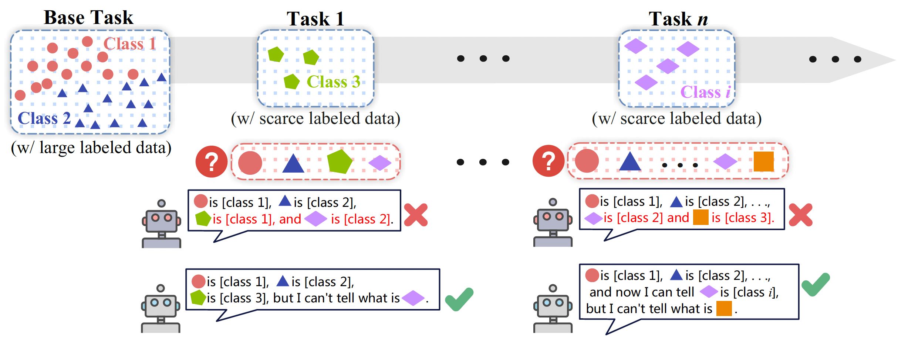

# Improving Open-world Continual Learning under the Constraints of Scarce Labeled Data

🎉Accepted by Proceedings of the 31st ACM SIGKDD Conference on Knowledge Discovery and Data Mining V.2 (**KDD '25**).

## 🎯Introduction

Open-world continual learning (OWCL) adapts to sequential tasks with open samples, learning knowledge incrementally while preventing forgetting. However, existing OWCL still requires a large amount of labeled data for training, which is often impractical in real-world applications. Given that new categories/entities typically come with limited annotations and are in small quantities, a more realistic situation is OWCL with scarce labeled data, i.e., few-shot training samples. Hence, this paper investigates the problem of open-world few-shot continual learning (OFCL), challenging in (i) learning unbounded tasks without forgetting previous knowledge and avoiding overfitting, (ii) constructing compact decision boundaries for open detection with limited labeled data, and (iii) transferring knowledge about knowns and unknowns and even update the unknowns to knowns once the labels of open samples are learned. In response, we propose a novel OFCL framework that integrates three key components: (1) an instance-wise token augmentation (ITA) that represents and enriches sample representations with additional knowledge, (2) a margin-based open boundary (MOB) that supports open detection with new tasks emerge over time, and (3) an adaptive knowledge space (AKS) that endows unknowns with knowledge for the updating from unknowns to knowns. Finally, extensive experiments show that the proposed OFCL framework outperforms all baselines remarkably with practical importance and reproducibility.



## 🔍 Highlights

- ✅ Addresses open-world continual learning under realistic few-shot constraints with limited supervision
- 🔄 Prevents forgetting and supports unknown-to-known transitions
- 🧠 Integrates ITA, MOB, and AKS for robust open-world learning

## 🔧 Code Reimplementation

To set up the environment, please follow the steps below:

```bash
pip install -r requirements.txt
```

## 📚 Cite This Work

If you find our work useful, please consider citing:

```bibtex
@inproceedings{li2025improving,
  title={Improving Open-world Continual Learning under the Constraints of Scarce Labeled Data},
  author={Yujie Li, Xiangkun Wang, Xin Yang, Marcello Bonsangue, Junbo Zhang, and Tianrui Li},
  booktitle={Proceedings of the 31st ACM SIGKDD Conference on Knowledge Discovery and Data Mining V.2 (KDD ’25)},
  year={2025},
  doi={10.1145/3711896.3737004}
}
```

## 📨 Contact

If you have any questions or are interested in this work, we would be happy to hear from you — please feel free to contact us at liyj1201@gmail.com
